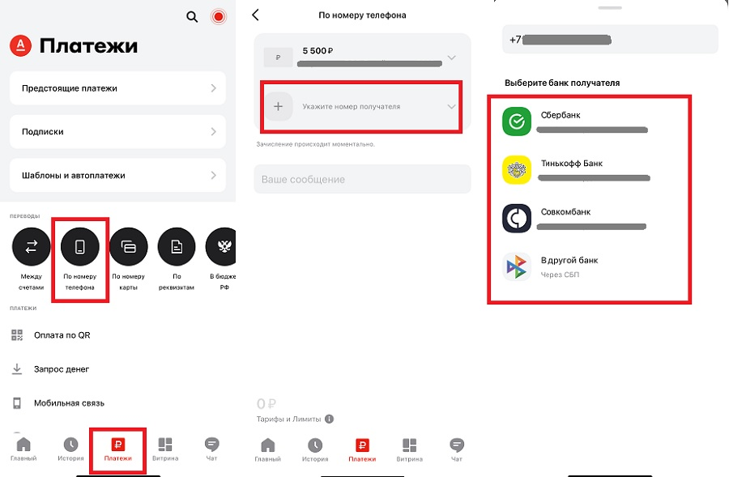
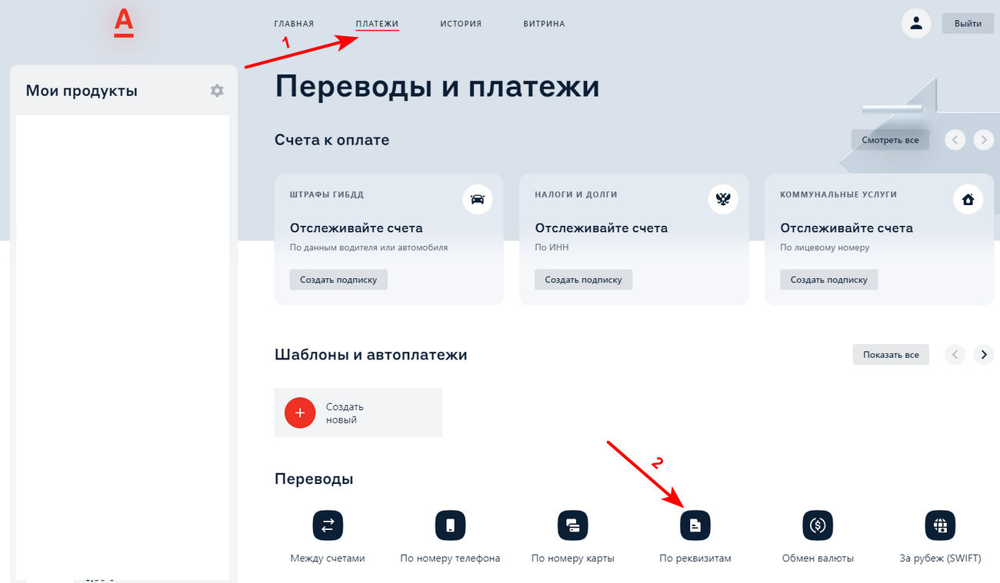
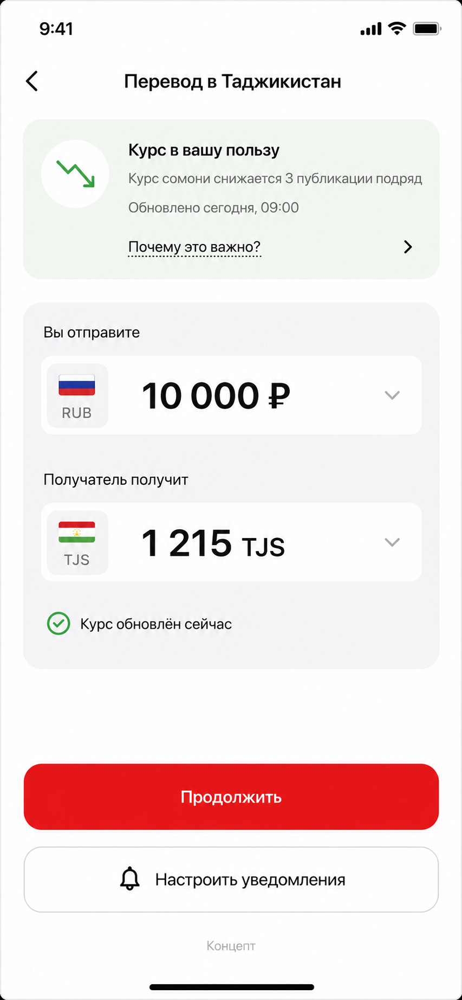
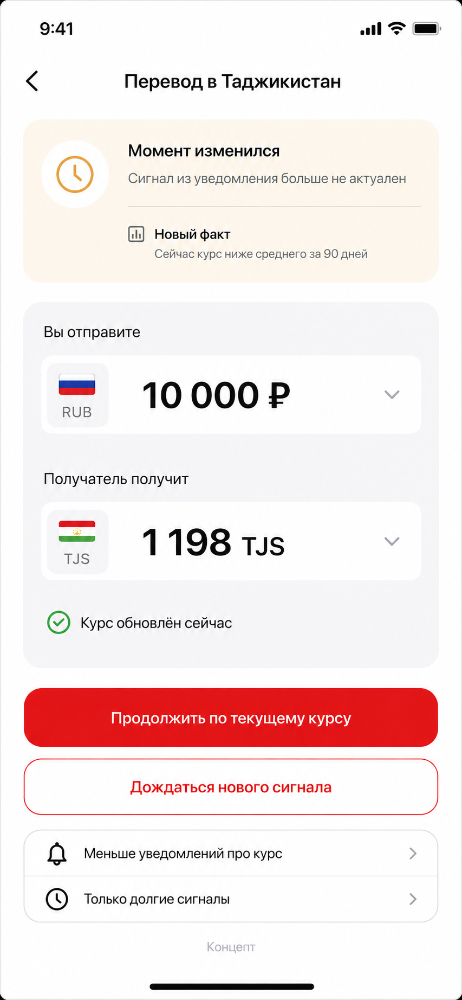

# Продуктовые материалы — промежуточная версия

**Статус на 4 сентября 2026 года**

## Пользователь и гипотеза

Пользователь регулярно переводит деньги семье в страну СНГ. Он знает сумму и получателя, но не лучший день. Следить за курсом долго. Если банк даст редкий и понятный факт о нужном коридоре, клиент чаще откроет перевод и сможет выбрать более удачный момент. Ценность: **банк следит за курсом вместо клиента**. Пуш говорит лишь о прошлом и настоящем: «Курс тенге снижается третий день подряд».

## Что требует кейс

- Сначала доказать качество сигнала; красивый экран его не заменяет.
- Встроиться в реальный путь приложения, а не переделывать банк.
- Учесть задержку открытия, часовой пояс и изменение курса после отправки.
- Для устаревшего сигнала сравнить несколько механик и обосновать выбор.
- Отдельно решить, когда безопасно предзаполнять перевод.
- Держать одно действие, 1–2 пуша в неделю и никаких обещаний о будущем.
- Собрать прототип агентными инструментами; обоснование и обзор практик важны не меньше графики.

## Текущий путь и референсы

Официальный путь Альфа-Банка: **Платежи → Переводы за рубеж → страна → валюта и способ**. Доступны приложение и Альфа‑Онлайн, перевод по телефону, карте, счёту или с выдачей наличными. Для страны интерфейс даёт свои подсказки; банк может определить получателя по номеру счёта и предзаполнить перевод себе ([справка](https://alfabank.ru/help/t/retail/debitcards/debetovaya-detskaya-karta/platezhi-i-perevodi/perevodi-v-valyute-i-za-granitsu/), [Alfa Digital](https://digital.alfabank.ru/digest/retail/2024-45)).

Публичные снимки нужны как визуальные референсы, не как доказательство точного интерфейса 2026 года:

Публичный мобильный референс: [1000bankov](https://1000bankov.ru/wiki/bystrye-platezhi-po-nomeru-telefona-kak-sdelat-perevod-iz-prilozheniya-alfa-banka/).

Публичный desktop-референс: [инструкция по Альфа‑Онлайн](https://uroki4mam.ru/instruktsiya-po-oplate-bankovskie-rekvizity).

## Предложенный сценарий

Пуш открывает обычную форму нужного коридора. Над суммой стоит компактная карточка. Она показывает индикатор, время расчёта и ссылку «Почему это важно?». Форма всегда показывает свежий курс и сумму получателя.

Если факт устарел, экран говорит это прямо. При наличии показывает новый актуальный индикатор. Клиент может продолжить по текущему курсу, дождаться нового сигнала или выбрать «Меньше уведомлений» / «Только долгие сигналы». Никакой срочности и скрытого сохранения старого курса.

## Аналоги

| Продукт | Что найдено | Вывод для нас |
|---|---|---|
| Альфа‑Банк | Мобильный и web-путь; подсказки по стране; частичное предзаполнение. | Добавить карточку, не ломая форму. |
| [Т‑Банк](https://www.tbank.ru/payments-and-transfers/cross-border/) | Сразу показывает курс и сумму получателя; выбор страны и способа. В инвестициях есть пользовательские [price alerts](https://www.tbank.ru/invest/settings/notifications/price_subscriptions/). | Всегда отделять свежий курс от причины пуша. |
| [Сбер](https://finance.rambler.ru/karty-i-platezhi/54873031-kak-perevesti-dengi-za-granitsu-cherez-sber-v-2025-godu-instruktsiya/) | Страна → способ → получатель → сумма → проверка; тарифы видны до подтверждения. | Статус сигнала показать до шага проверки. |

В публичных материалах этих банков мы не нашли готовой механики устаревшего курсового сигнала. Это не доказывает её отсутствие в закрытых версиях приложений.

Скриншоты для сравнения: [Т‑Банк](references/tbank-country-reference.png), [Сбер](references/sber-transfer-reference.png).

## Проверка и вклад AI Product

До финала сравним два состояния на пяти коридорах: понимание причины пуша, заметность свежего курса, доверие и готовность продолжить. Затем нужен A/B-пилот с holdout: инкрементальная конверсия, net-объём, каннибализация, отключения и жалобы. AI Product — Демир Берке — отвечает за путь, тексты и критерии теста. Инженерный контур передаёт экрану `indicator`, `sent_at`, `as_of`, актуальность и новое объяснение; интерфейс не делает выводов сам.
